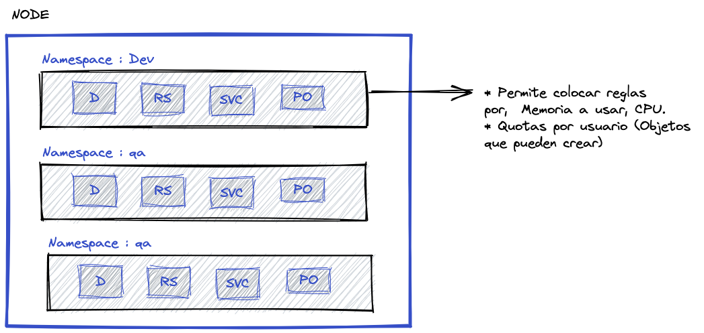

# Kubernetes, de principiante a experto

_Apuntes del curso UDEMY [Kubernetes, de principiante a experto](https://www.udemy.com/course/kubernetes-de-principiante-a-experto/)  desde hace 2 años no recibe actualización el material. :(  vamos a ver como nos va_

### Fallas
1. Módulo 5 video No. 24 no se puede crear un pod como explica en el video.
2. No se puede conectar a los puertos del pod creado solo por la linea de comando, los puertos no quedan expuestos incluso dentro del mismo host. Para esto se debe exponer un servicio en el cluster
(un ingress para hacer que se vea por fuera del cluster )

## Módulo 1 
## Módulo 2
## Módulo 3
## Módulo 4

## Módulo 5

Validar que minikube esté correindo

```
minikube status
```

Validar que el kubectl esté corriendo
```
kubectl get pods
```

Ver la versión del kubectl
```
kubectl version
```

La configuración de kubectl se almacena en ~/.kube/config o tambien se puede el siguente comanado
```
kubectl confing view
``` 
Para información del cluster y el control plane
```
kubectl cluster-info
```

### DashBoard Minikube - Acceso Remoto

El dashboar des una forma sencilla y administar, Para acceder al dashboard de minikube de forma remota (Desde un Mac/Linux). Para ver las caracteristicas habilitadas para el uso podemos usar

```
minikube addons list
```

Para habilitar las metricas en el servicio

```
minikube addons enable metrics-server
```


En la maquina virtual ejecutar
1. Iniciar el dashboad
```
minikube dashboard &
```

2. Activar el acceso al dashboar y quitqar las reglas
```
kubectl proxy --address='0.0.0.0' --disable-filter=true & 
```

Desde la mac
3. Para acceder remotamente usando ssh se mapea de la siguiente fomra
```
ssh -L 12345:localhost:8001 javing77@192.168.0.22
```
Esto hace un puente entre los puertos remoto asiando unos puertos temporales en este caso 12345, Para acceder al sitio hay usar 

```
http://localhost:12345/api/v1/namespaces/kubernetes-dashboard/services/http:kubernetes-dashboard:/proxy/#/pod/default/doscont?namespace=default
```


### Crear un pod
_Nota: El instructor usa kubectl run --generator la cual fue depreciado y eliminado, en este caso lo que se debe usar es run la forma mas sencilla de crear un pod sin usar un archivo yaml_


el nombre del pod debe ser en minuscula de lo contrario da error
```
# Crea un pod de una imagen de nginx con el nombre nginx
kubectl run Prueba --image=nginx --restart=Never

# Ver el estado del pod:
kubectl get pods
# kubectl get pods -o wide

# Ejemplo del resultado
NAME    READY   STATUS    RESTARTS   AGE
nginx   1/1     Running   0          2m8s

```

### Crear un DEPLOYMENT -> Según fuente de Linux Fundation
```
kubectl create deployment mynginx --image=nginx:1.15-alpine
```

Validar 
```
kubectl get deploy,rs,po -l app=mynginx
```

Incrementar el número de replicas
```
kubectl scale deploy mynginx --replicas=3
```


### Describir un pod
En caso que se desee ver los eventos que han pasado en un pod, lo cual ayuda identicar errores del porque un pod no se creó

```
kubectl describe pod nginx
```

### Obtener información detallada de un pod
Solo se debe agregar el parámetro -o yaml al get pod. Con esto se obtiene el manifiesto

```
kubectl get pod nginx -o yaml
```

Para ver el listado de operaciones que podemos hacer con kubectl podemos ejecutar
```
kubectl api-resources
```

### Eliminando un Pod
Se puede eliminar varios pods al mismo tiempo, solo se debe agregar los nombres
```
kubectl delete pod nginxx
```
### DOCKER y los PODS
Como se está usando docker como motor podemos ver los contenedores/pods creados por kubectl.
Pero estos contenedores no se deben administrar por docker si no por el kubectl
```
docker ps 
```

### Ingresar aun pod
Aunque pocas veces se ingresa directamente a un pod. Para salir usar el comando exit
```
kubectl exec -ti nginxpruebas -- bash
```

### Ver los logs de pod
```
kubectl logs nginxpruebas
```

### Manifiestos
Es un archivo en yaml que describe lo que debe contener el pod a crear. 
apiVersion : Podemos usar kubectl api-versions para ver las versiones que podemos usar. 

```
Kind: kubectl api-resources | grep Pod
metada: name: es el nombre del contenedor
spec: Se indican los contenedores que se quieren crear y sus diferentes caracteristicas
```
cuando se usan --- es para separar los recursos 

Aplicando un manifiesto

```
kubectl apply -f pythonserver.yaml
```


### Eliminando pods usando manifiestos
Cuando se usa el archivo yaml para borrar se borran todos los recursos los que estan establecidos en dicho archivo.
```
kubectl delete -f nginx01.yaml
```

### Creando dos contenedores por POD
Ver archivo Módulo5/pod/pythonServerDosContainers.yaml

Para ver el log de un pod que tiene dos o mas contenedores  se le agrega el parámetro -c al logs

```
kubectl logs doscont -c cont1
```

### Labels
Es metada que se le aplica a los pods, ayuda a indenticar , estois van dentro de la metadata


## Módulo 6 - ReplicaSets

### Que es un ReplicaSet
Un ReplicaSet se define con campos, incluyendo un selector que indica cómo identificar a los Pods que puede adquirir, un número de réplicas indicando cuántos Pods debería gestionar, y una plantilla pod especificando los datos de los nuevos Pods que debería crear para conseguir el número de réplicas esperado. Un ReplicaSet alcanza entonces su propósito mediante la creación y eliminación de los Pods que sea necesario para alcanzar el número esperado. Cuando un ReplicaSet necesita crear nuevos Pods, utiliza su plantilla Pod.

El enlace que un ReplicaSet tiene hacia sus Pods es a través del campo del Pod denominado metadata.ownerReferences, el cual indica qué recurso es el propietario del objeto actual. Todos los Pods adquiridos por un ReplicaSet tienen su propia información de identificación del ReplicaSet en su campo ownerReferences. Y es a través de este enlace cómo el ReplicaSet conoce el estado de los Pods que está gestionando y actúa en consecuencia.

Un ReplicaSet garantiza que un número específico de réplicas de un pod se está ejecutando en todo momento. Sin embargo, un Deployment es un concepto de más alto nivel que gestiona ReplicaSets y proporciona actualizaciones de forma declarativa de los Pods junto con muchas otras características útiles. Por lo tanto, se recomienda el uso de Deployments en vez del uso directo de ReplicaSets, a no ser que se necesite una orquestración personalizada de actualización o no se necesite las actualizaciones en absoluto.

En realidad, esto quiere decir que puede que nunca necesites manipular los objetos ReplicaSet: en vez de ello, usa un Deployment, y define tu aplicación en la sección spec.

[Más información de ReplicaSets](https://kubernetes.io/es/docs/concepts/workloads/controllers/replicaset/)

[Ejemplo-RS](KubernetesDePrincipianteAExperto/modulo6-rs/rs-01.yaml)

```
kubectl apply -f modulo6-rs/rs-01.yaml
kubectl describe rs/rs-frontend
kubectl get po -l tier=frontend
```

Se puede actulizar el archivo y volver aplicarlo y va a realizar esa configuración sobre los pods estabalecidos

Para saber quien es el dueño (owner) de un pod, podemos generar información del pod con los parámetros -o yaml

```
kubectl get po rs-frontend-xt7jr -o yaml > modulo6-rs/informacionPod1.yaml
```
[modulo6/informacionPod1.yaml](KubernetesDePrincipianteAExperto/modulo6-rs/informacionPod1.yaml)


a consultar el archivo generado podemos encontrar en la parte de la metada la si

```
metadata:
  creationTimestamp: "2022-04-21T22:29:02Z"
  generateName: rs-frontend-
  labels:
    tier: frontend
  name: rs-frontend-xt7jr
  namespace: default
  ownerReferences:
  - apiVersion: apps/v1
    blockOwnerDeletion: true
    controller: true
    kind: ReplicaSet
    name: rs-frontend
    uid: 60b36c25-41c4-462f-b213-392671eee269

```
El campo uid especifica quien es el owner, esto se puede validar haciendo un get rs rs-frontend -o yaml

_Nota: En caso que un pod no tenga de tenga ownerReference pero tenga el mismo label de un RS, el RS los hereda, no importa que sean del mismo tipo_

### Asignar un label a un pod existente.

```
kubectl label pod pruebapod1 tier=frontend
kubectl get po --show-labels pruebapod1
```

### Validar la nota anterior 
1. creamos una archivo yaml [modulo6-rs/rs-02.yaml](KubernetesDePrincipianteAExperto/modulo6-rs/rs-02.yaml) este manifiesto es de nuevo RS
2. Creamos un pod manualmente.
    ```
    kubectl run pruebapod1 --image=nginx:alpine
    kubectl label pod pruebapod1 tier=frontend
    ```
3. Validamos con un get pruebapod1 -o yaml que este no tenta metada.ownerReferences

4. Aplicamos el manifiesto 
```
kubectl apply -f modulo6-rs/rs-02.yaml
```

5. Ahora volvemos hacer un get prubeapod -o yaml y veremos que se agregó metada.ownerReferences

```
  ownerReferences:
  - apiVersion: apps/v1
    blockOwnerDeletion: true
    controller: true
    kind: ReplicaSet
    name: rs-frontend-2
    uid: a3dcf3ca-576a-4ccd-bac0-e8a43fda71a2
```

**NOTA: Por este motivo no se deberia crear pods de forma manual **


### Problemas de ReplicaSets.
En caso de realizar un cambio del manifiesto en la parte de los template ejemplo se cambia la versión de la imagen y aplicamos el manifiesto no va a ocurrir nada. Esto porque el RS solo mira que se cumpla la cantidad de pods solicitados. Excepto a que se force eliminando uno de los pods.

## Módulo 7 - Deployments

## Deployment

Un controlador de Deployment proporciona actualizaciones declarativas para los Pods y los ReplicaSets.

Cuando describes el estado deseado en un objeto Deployment, el controlador del Deployment se encarga de cambiar el estado actual al estado deseado de forma controlada. Puedes definir Deployments para crear nuevos ReplicaSets, o eliminar Deployments existentes y adoptar todos sus recursos con nuevos Deployments.

[Más información de Deployments](https://kubernetes.io/es/docs/concepts/workloads/controllers/deployment/)

### Creando un deployment

Un archivo de manimiento sus promera lineas deben ser apiVersion: apps/v1 kind: Deployment.

[Ejemplo-Deployment](KubernetesDePrincipianteAExperto/modulo7-deploy/deploy01.yaml)

1. Realizar el deploy del Deployent
```
kubectl apply -f modulo7-deploy/deploy01.yaml
kubectl get deploy
```

2. Validar los labels que tenga este deployment
```
kubectl get deployment --show-labels nginx-deployment
```

3. Ver el estados del deployment
```
kubectl rollout status deployment nginx-deployment
```

4. Validar  la existencia de los pods con --show-labels
```
kubectl get po --show-labels
```

5. A diferencia cuando se trabajó solo con el RS este no tenia un metada.ownerReferences pero como este RS fue creado con un Deployment este si cuenta con un metada.ownerReferences

```
kubectl get rs nginx-deployment-b9d465bf -o yaml
```

### Actualizar un Deployment para que este actualice sus PODs

Para este caso se actualizara la version del nginx pasandola a ser alpine
[modulo7-deploy/deploy02.yaml](KubernetesDePrincipianteAExperto/modulo7-deploy/deploy02.yaml)

```
kubectl apply -f modulo7-deploy/deploy02.yaml
```

Al aplicar este nuevo manifiesto, causará que los pod inicien a actualizarce uno a uno.
Para ver en tiempo real lo que está pasando 

```
kubectl rollout status deployment nginx-deployment
```

Obtener mas información del proceso del deployement
```
kubectl describe deployment nginx-deployment
```

[Más Información de RollOut](https://kubernetes.io/docs/tutorials/kubernetes-basics/update/update-intro/)

### Ver los rollout hechos a un deployment
Estos son básicamento nos dá información de los RS  que se han creado
```
kubectl rollout history deployment nginx-deployment
```

Esto se hace para poder regresar aun estado anterior. Por defecto se puede mantener hasta 10 de historico. Esto se puede cambiar en archivo de manifiesto con el parámentro __spec. revisionHistoryLimit: 5__

Es practico usar Change-Cause para que actualice los history quede el caso de actualizacion hay 3 formas

1. Usando el parámetro --record  el cuarda guarda cual fue el comando que se ejecutó **NOTA: ESTA OPCION ESTA MARCADA COMO DEPRECATED**
```
kubectl apply -f modulo7-deploy/deploy02.yaml --record
kubectl rollout history deployment nginx-deployment
``` 

2. Usnado metadata.annotations.kubernetes.io/change-cause: Ejemplo

[modulo7-deploy/deploy03.yaml](KubernetesDePrincipianteAExperto/modulo7-deploy/deploy03.yaml)

```
apiVersion: apps/v1
kind: Deployment
metadata:
  name: nginx-deployment
  labels:
    app: front
  annotations:
    kubernetes.io/change-cause: "Actualizar el puerto"
```

Aplicando el manifiesto y viendo el history del rollout

```
kubectl apply -f modulo7-deploy/deploy03.yaml
kubectl rollout history deployment nginx-deployment
```

3. Tambie se podría aplicar la anotación directamente al deployment. __kubectl annotate deployment/nginx-deployment kubernetes.io/change-cause="image updated to 1.16.1"__

### Ver los cambios hechos en un rollout

```
kubectl rollout history deployment nginx-deployment --revision=3
```

### HACIENDO UN ROLLBACK

Un rollback teoriacamente se puede hacer es porque la aplicación no está ejecutando como esperabmos que se hiciera o bien sea inestable .

Para este ejercicio se apicará una actlización al deploy pero colocando una imagen que no exista.
así generando error al momento de crear el pod

[modulo7-deploy/deploy04.yaml](KubernetesDePrincipianteAExperto/modulo7-deploy/deploy04.yaml)

```
kubectl apply -f modulo7-deploy/deploy04.yaml
kubectl get pods
```

    NAME                                READY   STATUS         RESTARTS   AGE
    nginx-deployment-68fd89c797-d2wx2   1/1     Running        0          13m
    nginx-deployment-68fd89c797-sv46c   1/1     Running        0          13m
    nginx-deployment-68fd89c797-wtw5h   1/1     Running        0          13m
    nginx-deployment-7d448bf6c8-ff4x4   0/1     ErrImagePull   0          3m14s

Para volver a un estado anterior
```
kubectl rollout undo deployment nginx-deployment --to-revision=3
```

# Módulo 8 Servicios
es el objeto de la API de Kubernetes que describe cómo se accede a las aplicaciones, tal como un conjunto de Pods, y que puede describir puertos y balanceadores de carga.

Con Kubernetes no necesitas modificar tu aplicación para que utilice un mecanismo de descubrimiento de servicios desconocido. Kubernetes le otorga a sus Pods su propia dirección IP y un nombre DNS para un conjunto de Pods, y puede balancear la carga entre ellos.
Motivación
[Más información] (https://kubernetes.io/docs/concepts/services-networking/service/)


Crear un archivo que contenga un deployment y simultaneamente el Servicie 

[modulo8-svc/svc-01.yaml](./KubernetesDePrincipianteAExperto/modulo8-svc/svc-01.yaml)

Aplicar el manifiesto:

```
kubectl apply -f modulo8-svc/svc-01.yaml
kubectl get services
kubectl get endpoints
```

### Ejecutando un pod temporar
```
kubectl run --rm -ti podtest3 --image=nginx:alpine -- sh
```

### Tipo de Servicios : ClusterIp
Es una ip virtual que kubernetes asingna al servicio y kubernetes se encarga que sea fija,
esta ip es interna. (solo absesible dentro del cluster).

Para definir el tipo de servicio se hace dentro del spec  "spec.type: CluserIp"

```
apiVersion: v1
kind: Service
metadata:
  name: my-service
  labels:
    app: front
spec:
  type: CluserIp
  selector:
    app: front-nginx
  ports:
    - protocol: TCP
      port: 8080
      targetPort: 80
```

### Tipo de Servicios : NodePort
Permite exponer el servicio por fuera del Nodo, una vez creado un servicio NodePort.
User  -----> Nodeport ------>   ClusterIp    ----> PODs

[Mas Información](https://kubernetes.io/docs/concepts/services-networking/service/)

[modulo8-svc/svc-np-03.yaml](KubernetesDePrincipianteAExperto/modulo8-svc/svc-np-03.yaml)

Aplicar el manifiesto:

```
kubectl apply -f modulo8-svc/svc-np-03.yaml
```

Para accder al recurso expuesto se hace a través de la ip del node de minikube esto funciona solo dentro de la maquina virtual.
```
kubectl get nodes -o wide
```

Para exponer el servicio por fuera de la máquina virtual
```
kubectl port-forward --address 0.0.0.0 service/my-service-backed 30227:8080
```

### Tipo de Servicios : LoadBalancer
Crea un servicio de Balanceador externo usando plataformas como AWS, AZUERE, GCP

# Módulo 9 - Goland

1. Crear el achivo main.go el cual va a ser un webservice rest básico en golang
[main.go](./KubernetesDePrincipianteAExperto/modulo9/backend/main.go)

2. Descargar la imagen de golang desde docker
```
docker pull golang
```

3. Crear un container que  va a disponibilizar el servicio : Esto es para la fase de desarrollo de la aplicación.

```
docker run --rm -dti -p 9090:9090 -v $PWD/modulo9/backend/:/go  --name gonlangsvc  golang bash
```

4. Accder al contenedor de docker
```
docker ps 
docker exec -ti id_contenedor bash
```

5. Crear una RESTAPI con GO
[main.go](./KubernetesDePrincipianteAExperto/modulo9/backend/main.go)

6. Crear un Dockerfile que construya una imagen para correr el main.go
[Dockerfile](./KubernetesDePrincipianteAExperto/modulo9/backend/Dockerfile)

7. Construir la imagen
```
docker build -t javing77/k8s-hands-on-golang .
docker push javing77/k8s-hands-on-golang
```

9. Correr la imagen previamente create
```
docker run -d -p 9090:9090 --name golang-hands-on k8s-hands-on-golang
```

10. Validar que el servicio esté ejecutandose correctamente.
```
curl localhost:9090
```

11. Eliminar el contenedor creado
```
docker rm -f golang-hands-on
``` 

12. Crear el manifiesto para la imagen 

# Modulo 10 Namespace
 


Brinda un scope 'Limite' de objectos (Deploy, SVC, PO, RS) entre otros objetos, Ejemplo un ambiente DEV, QAD dentro un mismo cluster pero separción logica.

Namespaces are a way to divide cluster resources between multiple users


  [Mas Informacion](https://kubernetes.io/docs/concepts/overview/working-with-objects/namespaces/)


Obtener namespace  

```
kubectl get namespaces
```

Obtener pods por namespaces

```
kubectl get  pods --namespace default
```

Mostrar los objetos que tiene un namespace 
```
kubectl get namespaces
kubectl get all -n lfs158
```

## Creando un namespace
1. Linea de comando 

```
kubect create namespace prueba1
```

2. Por yaml

[namespace.yaml](./KubernetesDePrincipianteAExperto/modulo10/namespace.yaml)

```
kubectl apply -f modulo10/namespace.yaml
kubectl get namespaces --show-labels
```

3. Creando un pod dentro del namespace
```
kubectl run  pruebanamespace --image=nginx:alpine --namespace kubernetes-de-principiante-a-experto
kubectl get po --namespace kubernetes-de-principiante-a-experto
```

## Creando namespaces con yaml multiples ambientes
[namespaces2](./KubernetesDePrincipianteAExperto/modulo10/namespace02.yaml)

```
kubectl apply -f modulo10/namespace02.yaml
```

## Crear un NS, DEPLOY y SVC  : Valindando como funcionan los DNS

Los namespaces se agregan en metadata.namespace de los diferentes objetos
[ns-dns-03.yaml](./KubernetesDePrincipianteAExperto/modulo10/ns-dns-03.yaml)

### Consumiendo un servicio desde un pod que no está en el mismo namespace

Se debe pasar el FQDN (Fully Qualified Domain Name)

```
curl nameSvc.nameNS.svc.cluster.local
curl go-backed-hand-on.ci.svc.cluster.local:9090
```

## Trabajando con el context

Trabajar con contextos nos ahorra estar pasando los parametros -ns para consultar los diferentes Objectos

1. Validar el contexto en el que nos encontramos.
```
kubectl config current-context
kubectl config view
```

2. Crear un contexto , para esto hay que pasar parámetros como NombreContexto, namespace  y el usuario. Para los datos se pueden usar los datos generados por los anteriores comandos
```
kubectl config set-context ci-context --namespace=ci --cluster=minikube --user=minikube
```

3. Cambiarnos de contexto.
```
kubectl config use-context ci-context
```

# Modulo11: Limites 
## Limitar el uso de la Ram


1. Ejemplo de uso de limites.

[LimitRam]('./KubernetesDePrincipianteAExperto/modulo11/limites.yaml')

2. Cuando un deploy solicita una cantidad de recursos, pero este se eleva mas de los establecidos, los pod se reinician para ver si estos pueden bajar.

[LimitRam2]('./KubernetesDePrincipianteAExperto/modulo11/limitesRam2.yaml')

3. Cuando un deploy solicita mas recursos de los que se cuentan en un node este quedaran en Pending pues no tiene recursos suficiendes para 
inicializarlo

[LimitRam]('./KubernetesDePrincipianteAExperto/modulo11/limitessRam3.yaml')

Para visualizar que esta causnado el error podemos hacerlo a través de un describe

```
kubectl describe po memory-demo
```
## Limitar uso de CPU

1. Adiferencia de los limites en ram, los pod no se les permite  pasar el limite establecido de cpu por esta razón no se reinician.
[LimitCpu](./KubernetesDePrincipianteAExperto/modulo11/limit-cpu.yaml)

Esto se puede validar usuando el describe del nodo
```
kubectl describe node minikube
```

El describe del node tambien en la parte de Capacity.cpu nos indica cuanta cpu pdemos contar.

2. Cuando se solicta la creación de un pod con mas cpu de la requerida. tampoco es creado.
[LimitCPU2](./KubernetesDePrincipianteAExperto/modulo11/limit-cpu2.yaml)

## QoS
Es una propiedad que se le asigna a un pod


    Guaranteed  -> Cuando el limit es igual al request
    Burstable   -> Cuando el limit es mayor al request
    BestEffort  -> Cuando no se define ni Guaranteed ni Burstable : Son los mas peligrosos debido a que no tienen limites.


# Modulo 12: LimitRange - Aprender a controlar el uso de recursos a Nivel de objetos

Es un objeto que permite controlar limites a nivel de objetos, colocando limites por defectos. El limitRange opera en los objetos del namespace donde ha sido creado.

crendo un Namespace y un LimintRange:
[limit-range-mem-cpu](./KubernetesDePrincipianteAExperto/modulo12/limitrange-mem.yaml)

```
kubectl get limitrange -n dev-kpe
```

Describir el recurso para ver los limites que contienen este limitrange, junto con un container pero a este no se le asinga limites
```
kubectl describe limitrange mem-limit-range -n dev-kpe
```


